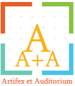

# Artiflex et Auditorium - Front-end
## Description
Projet réalisé dans le cadre de l'**UE E-Commerce, ECUE Application E-Commerce**
Ce projet concerne le developpement d'une application web de type réseau social dedié aux artistes et ses fans pour une communication plus exclusive. D'où son nom "**Artiflex et Auditorium**" (Artiste et Fan en français).

La partie client du projet est developpé avec **React**.
Quant à la partie serveur, elle s'appuie sur un API Rest developpé avec Rest **Framework de django** . Cette dernière se trouve se la branche [backend](https://github.com/mioraRabefandroana/AA/tree/backend) de ce dépôt.

## Auteur
**Miora RARABEFANDROANA**

## Principe de fonctionnement
- Un fan ou artiste peut s'abonner/se desabonner à autant de page d'artiste
- Seul les artistes ont le droit de publier
- Un fan ou artiste peut liker/unliker une publication
- Un fan ou artiste peut commenter/décommenter une publication

## Fonctionalités implémentées

- [x] **Création de compte**
    - [x] Artiste
    - [x] Fan

- [x] **Ajout / Modification des informations de compte**
    - [x] Détails personnelles
    - [x] Photo de profile
    - [x] Photo de couverture

- [x] **Consultation d'une page d'un artiste**
    - [x] Informations
    - [x] Publications

- [x] **Publication d'un post**
    - [x] Texte
    - [x] Image

- [x] **Abonnement / desabonnement à un artiste**
- [x] **Ajout de commentaire à une publication**

- [x] **Like / Unlike une publication**

## Screenshots

